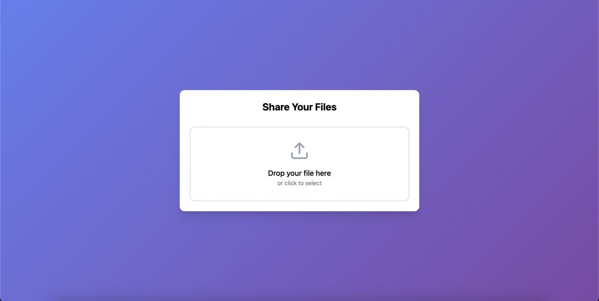

# Simple File Sharing Project

A simple file-sharing application built with React (TypeScript) for the frontend and PHP for the backend.

## Features

- Upload files
- Download files
- View file list
- Secure file storage

## Tech Stack

### Frontend:

- React (TypeScript)
- Axios (for API requests)
- Tailwind CSS (for styling)

### Backend:

- PHP

## Installation

1. Clone the repository:
   ```bash
   git clone https://github.com/dream-25/simple-file-sharing.git
   ```

2. Navigate to the directory:
3. Install dependencies:
   ```bash
   npm install
   ```
4. Start the React development server:
   ```bash
   npm run dev
   ```

5. Note: But for actual file upload you will need a PHP based web server


## Screenshot



## License

MIT License